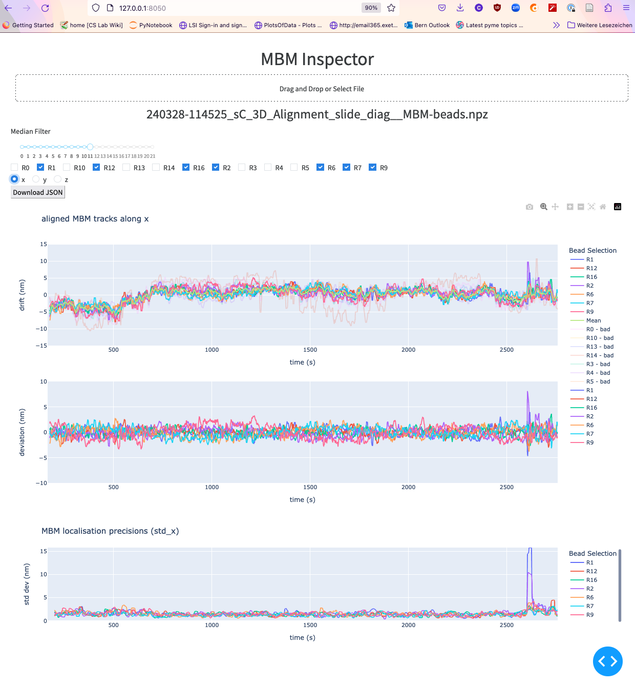

# MBM-inspector

### Synopsis

A fairly simple dash application to edit MBM trajectory generation.

To run the app you will need to:

1. make a suitable python environment,
2. run the app on your local machine,
3. point your browser to the URL that the app is served at...

#### Screenshot of a recent version



### Suitable python environment

In a nutshell, the commands are:

```shell
conda create --name dash-py310 --channel conda-forge python=3.10
conda install -c conda-forge dash
conda install -c conda-forge pandas

pip install dash_bootstrap_components
```

### Run the app

Open a cmd shell and activate the conda environment that you created. Using the naming we adopted above, this is

	conda activate dash-py310

Now cd into the directory into which you cloned `MBM-inspector` and start the app by typing

	python app.py

This generates some output on my machine:

```
Dash is running on http://127.0.0.1:8050/

 * Serving Flask app 'app'
 * Debug mode: on
```

Note the URL to which you now need to point your browser

### Access App in your browser

Open the URL that was printed out in your browser. In our example above, paste the `http://127.0.0.1:8050/` into your browser to open this URL and see the MBM-inspector app at work.

### Using the app

The user interface is currently still in a bit of flux. Hopefully the user interface is sort of intuitive...

An MBM report of a sort can be generated by printing the final result to PDF (using your browsers print dialog), and doing this for x, y, and z settings, save these into seperate PDFs and concatenate them using your tool of choice to get one one PDF.

You can also download a JSON file that records the bead selection, file name of MBM bead info and median filter settings. This could be useful to "replay" the settings later and feed this info to PYME at some stage for drift correction.

In the repository there is a sample report generated in this way.